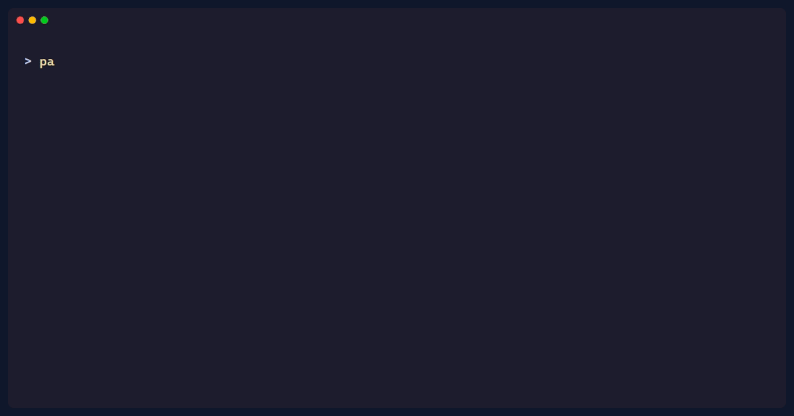

# Pagonic

Pagonic is an alpha Python ZIP toolkit focused on safe archive inspection,
secure extraction, and repeatable local benchmarking. Its main idea is simple:

> Inspect before you extract.

<p align="center">
  
</p>

The intended workflow is visible in the demo: inspect the archive, verify it
against an explicit risk threshold, and let `safe-extract` refuse unsafe input
before it writes files.

* A core library for inspecting, writing, reading, and validating ZIP archives.
* A `pagonic` command-line interface for inspect, verify, safe extract, and ZIP utilities.
* An optional PyQt6 GUI launched with `pagonic-gui`.

This repository contains the `v0.5.0` alpha release. The import package remains
`Pagonic` for compatibility; the distribution name is `pagonic`. The package is
available on [PyPI](https://pypi.org/project/pagonic/) and the matching release
is also available on [TestPyPI](https://test.pypi.org/project/pagonic/) for
publication checks. The source and release artifacts remain available from the
[GitHub release](https://github.com/SetraTheXX/pagonic/releases/tag/v0.5.0).

## Project Story

Pagonic started more than a year ago as one of my earliest software-learning projects. Its first direction was much broader and more experimental: a ZIP/archive engine with compression, extraction, GUI ideas, benchmarking, and performance experiments.

After many iterations, I revised the project direction and narrowed the public scope into something clearer:

> Pagonic is not trying to be another desktop archive manager.
> It is becoming a security-aware ZIP inspection and safe extraction toolkit.

This `v0.5.0` release builds on the first cleaned-up public direction from
`v0.4.0`. It keeps the useful ZIP core, CLI, tests, and safety work while making
the inspection policy, regression corpus, automation examples, package surface,
and compatibility boundaries explicit.

Pagonic is still evolving, but its purpose is now clearer: inspect first, extract safely.

## Install

For normal CLI use, install the published package from PyPI:

```bash
python -m pip install pagonic
```

For an isolated command-line installation, either `uv` or `pipx` can manage the
tool environment:

```bash
uv tool install pagonic
pipx install pagonic
```

Verify the installation:

```bash
pagonic --version
```

For local development, clone the repository first and install from the checkout.

For CLI-only use from a local checkout:

```bash
python -m pip install .
```

For local development:

```bash
python -m pip install -e .[dev,gui]
```

For CLI-only development with test dependencies:

```bash
python -m pip install -e .[dev]
```

Experimental performance helpers are optional and are not required by inspection
or safe extraction:

```bash
python -m pip install -e .[performance]
```

The GUI is optional. If PyQt6 is not installed, `pagonic-gui` exits with a clear install message.

## CLI Quick Start

```bash
pagonic --help
pagonic inspect suspicious.zip
pagonic inspect suspicious.zip --json
pagonic inspect suspicious.zip --markdown
pagonic verify release.zip
pagonic verify release.zip --max-risk medium
pagonic safe-extract upload.zip output/
pagonic safe-extract upload.zip output/ --dry-run
pagonic list archive.zip --tree
pagonic compress path/to/file.txt -o archive.zip
pagonic config list
```

Use `inspect` before extraction for untrusted ZIP files. `safe-extract` applies
the inspection gate before writing files, supports `--dry-run`, and refuses ZIP
entries that use unsupported compression methods.

## Python API Quick Start

```python
from Pagonic.core.formats.zip_writer import ZipWriter
from Pagonic.core.formats.zip_reader import ZipReader

writer = ZipWriter("archive.zip", compression_level=6)
writer.add_file("file.txt")
writer.finalize()

reader = ZipReader("archive.zip")
report = reader.inspect()

if report.risk_level in {"ok", "low"}:
    reader.extract_all("output")
```

## Project Layout

```text
Pagonic/          Python package
tests/            pytest suite
docs/             public documentation
examples/         small runnable examples
pyproject.toml    package metadata and tool config
```

## Documentation

- [Architecture](docs/architecture.md)
- [User Guide](docs/user-guide.md)
- [Inspection Policy Contract](docs/inspection-policy.md)
- [Inspection JSON Schema Contract](docs/inspection-schema.md)
- [CI Integration](docs/ci-integration.md)
- [Package Surface Audit](docs/package-audit.md)
- [Package Publishing](docs/package-publishing.md)
- [0.5 Migration Notes](docs/migration-0.5.md)
- [0.5 Release Audit](docs/release-audit-0.5.md)
- [SARIF Evaluation](docs/sarif-evaluation.md)
- [ZipHandler Compatibility Policy](docs/zip-handler-compatibility.md)
- [Developer Guide](docs/developer-guide.md)
- [0.4 Migration Notes](docs/migration-0.4.md)
- [Roadmap](docs/roadmap.md)
- [Changelog](CHANGELOG.md)
- [Contributing](CONTRIBUTING.md)
- [Security Policy](SECURITY.md)
- [Code of Conduct](CODE_OF_CONDUCT.md)

## Contributing

Focused contributions are welcome, especially improvements to inspection
determinism, security regression coverage, safe extraction policy, CI
integration, and documentation. Read [CONTRIBUTING.md](CONTRIBUTING.md), check
[the 0.5 roadmap](docs/roadmap.md), and use the issue templates before opening
a pull request. Do not include private plans, local paths, secrets, generated
archives, or benchmark output in public changes.

## Risk Signals

Inspection reports are deterministic and do not use runtime AI. Current risk
flags include:

| Flag                             | Severity   | Meaning                                                                                |
| -------------------------------- | ---------- | -------------------------------------------------------------------------------------- |
| `path_traversal`                 | `high`     | Entry contains `..` path segments.                                                     |
| `absolute_path`                  | `high`     | Entry uses a POSIX absolute path.                                                      |
| `windows_drive_path`             | `high`     | Entry looks like a Windows drive path.                                                 |
| `hidden_file`                    | `low`      | Entry basename starts with `.`.                                                        |
| `empty_filename`                 | `medium`   | Entry cannot be mapped to a useful safe path.                                          |
| `too_many_files`                 | `high`     | Archive exceeds the configured file-count limit.                                       |
| `large_uncompressed_size`        | `high`     | Archive exceeds the configured uncompressed-size limit.                                |
| `high_compression_ratio`         | `high`     | Entry expands much more than its compressed size.                                      |
| `unsupported_compression_method` | `medium`   | Entry uses a ZIP method Pagonic does not currently support; `safe-extract` refuses it. |
| `crc_or_structure_error`         | `critical` | ZIP structure or CRC validation failed.                                                |
| `suspicious_extension`           | `medium`   | Entry has an executable or script-like extension.                                      |
| `duplicate_filename`             | `high`     | The same archive filename appears more than once.                                      |
| `normalized_path_collision`      | `high`     | Different names resolve to the same sanitized path.                                    |
| `case_insensitive_collision`     | `high`     | Names collide on case-insensitive filesystems.                                         |
| `unicode_normalization_collision`| `high`     | Different Unicode spellings normalize to one path.                                     |
| `symlink_entry`                  | `high`     | ZIP metadata marks the entry as a symbolic link.                                       |
| `encrypted_entry`                | `high`     | Entry contents cannot be validated by the current workflow.                            |
| `nested_archive`                 | `low`      | Entry appears to contain another archive; it is not recursively inspected.             |
| `long_filename`                  | `medium`   | Entry name exceeds the configured review length.                                       |
| `long_archive_comment`           | `low`      | Archive comment exceeds the configured review length.                                  |

`pagonic inspect --json` emits a stable alpha report with archive totals,
overall `risk_level`, top-level `risk_flags`, `recommended_action`, and per-entry
metadata. Entries preserve archive order and risk flags use a deterministic
catalog order. See the [Inspection JSON Schema Contract](docs/inspection-schema.md)
for canonical fields, compatibility aliases, ordering guarantees, and clean,
risky, and invalid report examples. `pagonic inspect --markdown` renders the
same inspection as a saved human-readable report.

## Command Policy

Use `inspect` before extraction when the archive is untrusted. For automation,
`verify` returns exit code `0` only when the report is within `--max-risk` and
has no validation errors. `safe-extract` applies the same inspection gate before
writing files and supports `--dry-run`.

See the [inspection policy contract](docs/inspection-policy.md) for the exact
clean/risky/invalid decision table, defaults, unsupported-method rule, and exit
codes.

The older `extract` command remains as a compatibility command for trusted
archives. It uses secure path handling, but it is not an inspection policy gate;
use `safe-extract` for untrusted input. `list` and `info` are read-only display
commands and do not replace an inspection report.

## Status

The current public release is `0.5.0`: an alpha-stage, test-backed release with
security-aware ZIP inspection, explicit policy gates, a synthetic security
regression corpus, gated safe extraction, core ZIP behavior, CLI support,
optional GUI packaging, MIT license, and CI-ready tests.

Pagonic is not intended for production-critical automation yet and is not
positioned as a general multi-format desktop archive manager. The next work is
evidence-driven maintenance: collect real usage signals, expand the security
corpus when new rules are added, and revisit deferred integrations only when a
concrete consumer justifies them.
